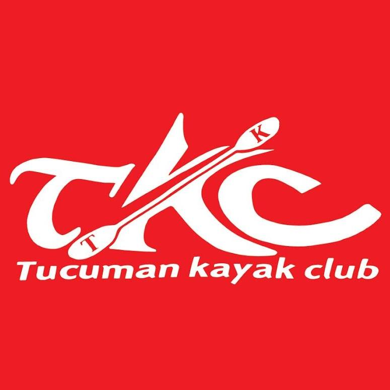

#  Tucuman Kayak Club

Bienvenido al repositorio del Tucumán Kayak Club, un proyecto diseñado para centralizar la información sobre las actividades de turismo aventura que ofrecemos. A través de esta página web, los visitantes pueden explorar en detalle los servicios disponibles y dejar reseñas sobre sus experiencias.

**Página web:** https://tucumankayakclub.netlify.app/



## Tabla de contenidos
- Descripcion general
- Ver página web
- Caracteristicas
- Tecnologias utilizadas
- Instalacion
- Uso
- Estructura del proyecto
- Licencia
- Contacto

### Descripción General
Este proyecto implica la creación de una página web para una empresa de turismo aventura. La página web centraliza la información sobre la empresa y sus actividades, ofreciendo a los visitantes la oportunidad de explorar en detalle los servicios disponibles, como senderismo, excursiones en kayak, rappel, entre otros. Además, permite a los usuarios dejar reseñas y comentarios sobre sus experiencias, generando confianza y credibilidad en la empresa.
### Características

- **Página de inicio**: Informacion general de todo el sitio.
- **Sobre nosotros**: Informacion detallada sobre la empresa y su equipo.
- **Servicios**: Descripcion de todas las actividades de turismo aventura ofrecidas.
- **Contacto**: Formulario de contacto y links a redes sociales.
- **Donde encontrarnos**: Informacion detallada sobre como llegar a la empresa e imagenes ilustrativas de la priemra vista y mapa de google maps para una mejor ubicacion.
- **Seccion administrador**: Gestion de comentarios y reseñas de usuarios.
- **Autenticación**: Inicio de sesion para usuarios administradores.

### Tecnologias utilizadas

- **Frontend**: React vite.
- **Routing**: React Router.
- **Estado**: useState, useEffect.
- **Estilos**: CSS, Slick, Bootstrap.
- **Animacion**: Data-os.
- **Otros**: Google Maps API para la ubicacion.

### Instalación
Para ejecutar el proyecto localmente sigue estos pasos:

**1- Clonar el repositorio**
git clone https://github.com/tu-usuario/tucumankayakclub.git

**2- Navegar al directorio del proyecto**
cd tucumankayakclub

**3- Instalar dependencias**
npm install

**4- Iniciar la aplicación**
npm start

La aplicación se ejecutará en **http://localhost:3000**

### Uso

##### Navegación

La navegaciín se realiza a través del menú en la parte superior de cada página, que incluye enlaces a las principales secciones: Inicio, Sobre Nosotros, Servicios, Donde encontrarnos y Contacto.

#### Formulario de contacto

Para enviar una consulta:

1- Navegar a la seccion "Contacto"
2- Completar los campos del formulario (nombre, correo electronico y mensaje)
3- Hacer click en "enviar"

#### Seccion de administradores

Para acceder al panel de administrador:

1- Escribir el nombre de la pagina seguido de "/administrador" o "/login" en la barra de busqueda del navegador web.
2- Ingresar las credenciales de administrador.
3- Gestionar los comentarios y reseñas desde el panel.
###Diagrama de flujo para el Login

```flow
st=>start: Login
op=>operation: Realizar login
cond=>condition: Credenciales correctas?
e=>end: Bienvenido, eres administrador

st->op->cond
cond(yes)->e
cond(no)->op
```
```
```
#### Estructura del proyecto

tucumankayakclub/
│
├── public/
│   ├── index.html
│   └── ...
│
├── src/
│   ├── components/
│   │   ├── common/
│   │   │   ├── Header.js
│   │   │   └── Footer.js
│   │   ├── views/
│   │   │   ├── Inicio.js
│   │   │   ├── PaginaSobreNosotros.js
│   │   │   ├── servicios/
│   │   │   │   ├── Excursiones.js
│   │   │   │   ├── Escuela.js
│   │   │   │   ├── ...
│   │   │   ├── Administrador/
│   │   │   │   ├── Administrador.js
│   │   │   │   ├── Login.js
│   │   │   │   └── ...
│   │   ├── routes/
│   │   │   ├── RutasProtegidas.js
│   │   │   ├── RutasAdministrador.js
│   │   │   └── ...
│   │   └── App.js
│   ├── index.js
│   └── ...
│
├── package.json
└── README.md

#### Contacto

Para más informacion o consultas, puedes contactarnos en:

-  **Correo electrónico:** joaquin.fuentes1327@gmail.com
- **Teléfono:** 3816097754
- **Dirección**: Calle España 2456, San Miguel de Tucuman, Tucuman, Argentina.


.

